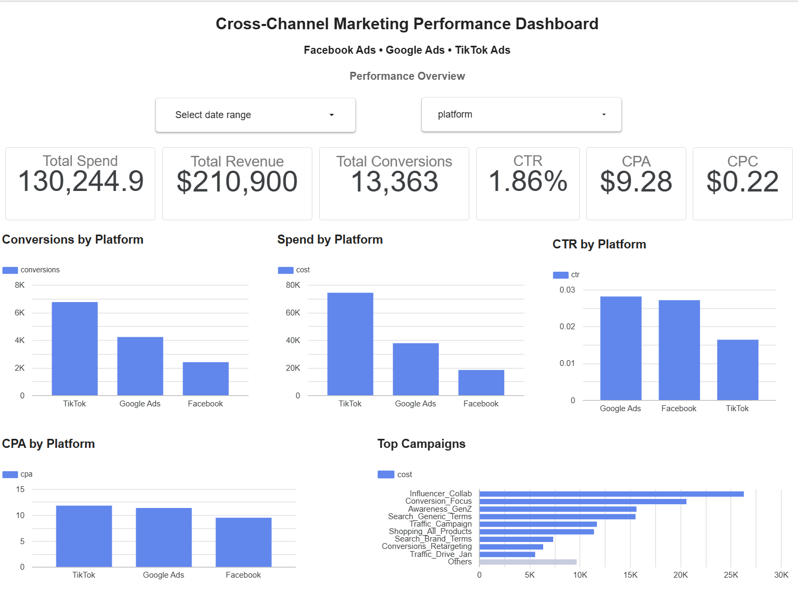
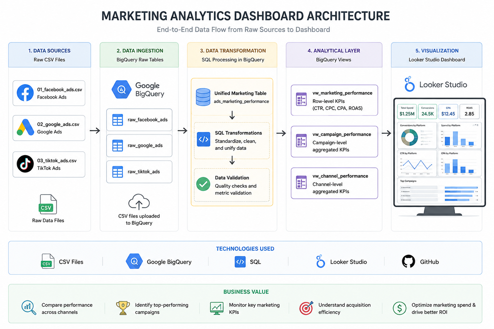

# Cross-Channel Marketing Analytics Dashboard

## Project Summary

Built an end-to-end marketing analytics solution using SQL, BigQuery, and Looker Studio.

The project ingests raw Facebook Ads, Google Ads, and TikTok Ads data, standardizes different schemas, creates analytical reporting layers, validates data quality, and delivers an interactive dashboard for marketing performance analysis.

### Live Dashboard
🔗 (https://datastudio.google.com/reporting/6b6d395a-a1e4-4fa3-89a5-08570f36a910)

### Technologies
Google BigQuery • SQL • Looker Studio • GitHub

## Dashboard Preview



________________________________________
## Project Overview

This project demonstrates how to build a complete marketing analytics workflow using raw CSV files, SQL transformations, BigQuery, and Looker Studio.

The goal was to create a unified reporting layer for cross-channel performance analysis across Facebook Ads, Google Ads, and TikTok Ads.

The project includes:

- Data ingestion from CSV files
- Data standardization across platforms
- SQL transformations in BigQuery
- Data validation checks
- Reporting views for analytics
- Interactive dashboard in Looker Studio
________________________________________
## Technologies Used

- Google BigQuery
- SQL
- Looker Studio
- GitHub
- CSV Data Sources
________________________________________
Data Flow
Raw CSV Files
        ↓
BigQuery Raw Tables
        ↓
Unified Marketing Table
        ↓
Analytical Views
        ↓
Looker Studio Dashboard
________________________________________

---

## Project Workflow

### Step 1: Raw Data Upload

The project started with three raw CSV files:

- Facebook Ads
- Google Ads
- TikTok Ads

The files were uploaded into BigQuery as separate raw tables:

- `raw_facebook_ads`
- `raw_google_ads`
- `raw_tiktok_ads`

These tables represent the original source data before any transformation.

## Dataset Information

- Total Records: 330
- Platforms: Facebook Ads, Google Ads, TikTok Ads
- Date Range: January 2024
- Data Source: Marketing advertising performance data

---

### Step 2: Data Standardization

Each advertising platform used different field names and metrics.

Examples:

| Facebook Ads | Google Ads | TikTok Ads | Standardized Name |
|-------------|------------|------------|------------------|
| ad_set_id | ad_group_id | adgroup_id | ad_group_id |
| ad_set_name | ad_group_name | adgroup_name | ad_group_name |
| spend | cost | cost | cost |

The data was standardized to create a consistent structure across all platforms.

---

### Step 3: Create Unified Marketing Table

A unified table called `ads_marketing_performance` was created using SQL and `UNION ALL`.

The table combines Facebook Ads, Google Ads, and TikTok Ads into a single reporting layer.

**Output Table**

```sql
ads_marketing_performance
```

**SQL File**

```text
SQL/01_create_ads_marketing_performance.sql
```

---

### Step 4: Create KPI View

A reporting view was created to calculate row-level marketing KPIs.

Calculated metrics:

- CTR
- CPC
- CPA
- Conversion Rate
- ROAS

**Output View**

```sql
vw_marketing_performance
```

**SQL File**

```text
SQL/02_create_vw_marketing_performance.sql
```

---

### Step 5: Create Campaign Performance View

A campaign-level reporting view was created to analyze campaign performance.

Metrics included:

- Spend
- Impressions
- Clicks
- Conversions
- CTR
- CPC
- CPA
- Conversion Rate
- ROAS

**Output View**

```sql
vw_campaign_performance
```

**SQL File**

```text
SQL/03_create_vw_campaign_performance.sql
```

---

### Step 6: Create Channel Performance View

A channel-level reporting view was created to compare advertising platforms.

Platforms:

- Facebook Ads
- Google Ads
- TikTok Ads

**Output View**

```sql
vw_channel_performance
```

**SQL File**

```text
SQL/04_create_vw_channel_performance.sql
```

---

### Step 7: Data Validation

Before building the dashboard, several validation checks were performed in BigQuery.

#### Row Count Validation

Validated the number of records loaded from each platform.

#### Date Range Validation

Verified minimum and maximum dates in the dataset.

#### Metric Reconciliation

Validated:

- Impressions
- Clicks
- Spend
- Conversions
- Revenue

across all platforms.

#### Revenue Validation

Revenue data was available only for Google Ads.

Because of this, ROAS calculations are available only where revenue exists.

#### KPI Validation

CTR calculations were compared using:

- Average CTR
- Weighted CTR

to ensure KPI accuracy.

#### Null Checks

Validated critical fields:

- date
- platform
- campaign_id
- impressions
- clicks
- cost
- conversions

---

### Step 8: Build Looker Studio Dashboard

The final step was creating an interactive dashboard in Looker Studio.

Dashboard components include:

- KPI Scorecards
- Date Range Filter
- Platform Filter
- Conversions by Platform
- Spend by Platform
- CTR by Platform
- CPA by Platform
- Top Campaigns

---

## Data Flow

```text
Raw CSV Files
        ↓
BigQuery Raw Tables
        ↓
Unified Marketing Table
        ↓
Analytical Views
        ↓
Looker Studio Dashboard
```

---

## Project Architecture



---

## Project Structure

```text
marketing-analytics-dashboard
│
├── data
│   ├── 01_facebook_ads.csv
│   ├── 02_google_ads.csv
│   └── 03_tiktok_ads.csv
│
├── SQL
│   ├── 01_create_ads_marketing_performance.sql
│   ├── 02_create_vw_marketing_performance.sql
│   ├── 03_create_vw_campaign_performance.sql
│   └── 04_create_vw_channel_performance.sql
│
├── images
│   ├── architecture_diagram.png
│   └── dashboard_overview.png
│
└── README.md
```

---

## KPIs Used

| KPI | Formula |
|------|---------|
| CTR | Clicks / Impressions |
| CPC | Cost / Clicks |
| CPA | Cost / Conversions |
| Conversion Rate | Conversions / Clicks |
| ROAS | Revenue / Spend |
| Total Spend | SUM(Cost) |
| Total Conversions | SUM(Conversions) |
| Revenue | SUM(Conversion Value) |

---

## Key Insights

- TikTok generated the highest number of conversions.
- Google Ads showed the strongest CTR, meaning users engaged more frequently with those ads.
- Facebook Ads had the lowest CPA, making it the most cost-efficient channel for conversions.
- Revenue data was available only for Google Ads, limiting revenue-based analysis for other channels.
- The dashboard provides a centralized view of marketing performance across channels and campaigns.

---

## Business Value

This project helps marketing stakeholders:

- Compare performance across advertising channels
- Identify top-performing campaigns
- Monitor marketing KPIs
- Understand acquisition efficiency
- Optimize marketing spend
- Make data-driven budget allocation decisions

---

